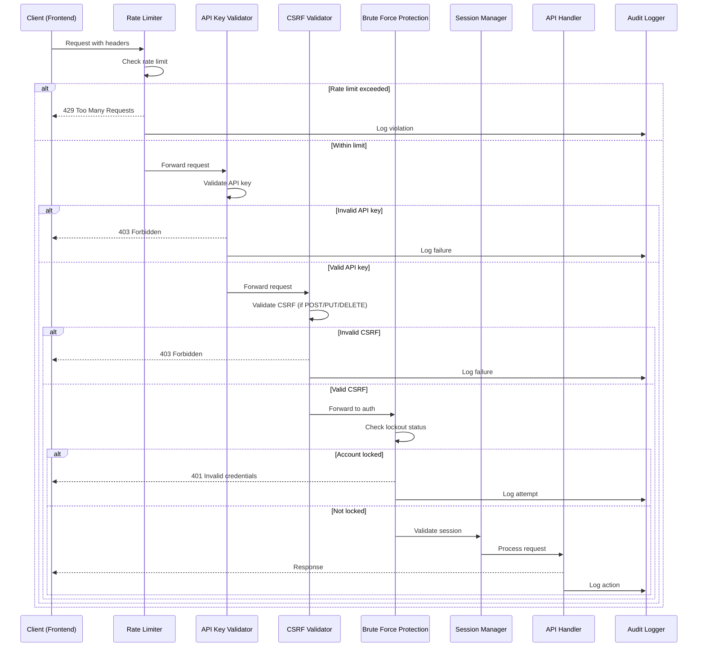

# Design Document: API Security Hardening

## Overview

Dokumen ini menjelaskan desain teknis untuk mengamankan API backend RAF NET CCTV Hub. Sistem keamanan ini terdiri dari beberapa layer perlindungan yang bekerja bersama untuk mencegah akses tidak sah, serangan brute force, dan eksploitasi kerentanan umum.

### Security Architecture

```
┌─────────────────────────────────────────────────────────────────────┐
│                         INTERNET                                     │
└─────────────────────────────────────────────────────────────────────┘
                                │
                                ▼
┌─────────────────────────────────────────────────────────────────────┐
│                    SECURITY MIDDLEWARE CHAIN                         │
│  ┌──────────┐  ┌──────────┐  ┌──────────┐  ┌──────────┐            │
│  │  Rate    │→ │  API Key │→ │  CSRF    │→ │  Input   │            │
│  │  Limiter │  │  Validator│  │  Check   │  │  Sanitize│            │
│  └──────────┘  └──────────┘  └──────────┘  └──────────┘            │
└─────────────────────────────────────────────────────────────────────┘
                                │
                                ▼
┌─────────────────────────────────────────────────────────────────────┐
│                      AUTHENTICATION LAYER                            │
│  ┌──────────────┐  ┌──────────────┐  ┌──────────────┐              │
│  │ Brute Force  │  │   Session    │  │   Password   │              │
│  │  Protection  │  │   Manager    │  │   Validator  │              │
│  └──────────────┘  └──────────────┘  └──────────────┘              │
└─────────────────────────────────────────────────────────────────────┘
                                │
                                ▼
┌─────────────────────────────────────────────────────────────────────┐
│                        AUDIT LAYER                                   │
│  ┌──────────────────────────────────────────────────────────┐      │
│  │              Security Audit Logger                        │      │
│  │  - Authentication events  - Rate limit violations         │      │
│  │  - API key failures       - Admin actions                 │      │
│  └──────────────────────────────────────────────────────────┘      │
└─────────────────────────────────────────────────────────────────────┘
                                │
                                ▼
┌─────────────────────────────────────────────────────────────────────┐
│                      FASTIFY API ROUTES                              │
└─────────────────────────────────────────────────────────────────────┘
```

## Architecture

### Middleware Chain Design

Setiap request melewati chain of middleware dalam urutan tertentu:

1. **Security Headers Middleware** - Menambahkan security headers ke semua response
2. **Rate Limiter Middleware** - Membatasi jumlah request per IP
3. **API Key Validator Middleware** - Memvalidasi API key dari frontend
4. **CSRF Token Middleware** - Memvalidasi CSRF token untuk state-changing requests
5. **Input Sanitizer Middleware** - Membersihkan dan memvalidasi input
6. **Auth Middleware** - Memvalidasi JWT token (untuk protected routes)


### Request Flow Diagram



## Components and Interfaces

### 1. Rate Limiter Component

```javascript
// backend/middleware/rateLimiter.js

/**
 * Rate limiter configuration per endpoint type
 */
const RATE_LIMITS = {
    public: { max: 100, window: 60 },      // 100 req/min
    auth: { max: 30, window: 60 },          // 30 req/min
    admin: { max: 60, window: 60 },         // 60 req/min
    whitelist: ['/health', '/api/stream']   // No rate limit
};

/**
 * Sliding window rate limiter using in-memory store
 * @param {string} key - Unique identifier (IP + endpoint)
 * @param {number} limit - Max requests allowed
 * @param {number} window - Time window in seconds
 * @returns {Object} { allowed: boolean, remaining: number, resetAt: Date }
 */
function checkRateLimit(key, limit, window) {
    // Implementation uses sliding window algorithm
}
```

### 2. API Key Validator Component

```javascript
// backend/middleware/apiKeyValidator.js

/**
 * API Key validation middleware
 * Validates X-API-Key header against stored keys
 */
const API_KEY_CONFIG = {
    headerName: 'X-API-Key',
    keyLength: 64,
    rotationDays: 30
};

/**
 * Generate secure API key for frontend
 * @returns {string} 64-character hex string
 */
function generateApiKey() {
    return crypto.randomBytes(32).toString('hex');
}

/**
 * Validate API key from request
 * @param {string} apiKey - Key from header
 * @returns {Object} { valid: boolean, clientId: string }
 */
function validateApiKey(apiKey) {
    // Check against stored keys with timing-safe comparison
}
```


### 3. CSRF Protection Component

```javascript
// backend/middleware/csrfProtection.js

/**
 * CSRF token configuration
 */
const CSRF_CONFIG = {
    tokenLength: 32,
    headerName: 'X-CSRF-Token',
    cookieName: 'csrf_token',
    expirationMinutes: 60
};

/**
 * Generate CSRF token and set cookie
 * @param {Reply} reply - Fastify reply object
 * @returns {string} Generated token
 */
function generateCsrfToken(reply) {
    const token = crypto.randomBytes(32).toString('hex');
    // Set httpOnly cookie with token
    return token;
}

/**
 * Validate CSRF token from header against cookie
 * @param {Request} request - Fastify request object
 * @returns {boolean} Token validity
 */
function validateCsrfToken(request) {
    // Compare header token with cookie token
}
```

### 4. Brute Force Protection Component

```javascript
// backend/middleware/bruteForceProtection.js

/**
 * Brute force protection configuration
 */
const BRUTE_FORCE_CONFIG = {
    maxAttempts: {
        username: 5,    // Per username
        ip: 10          // Per IP address
    },
    lockoutDuration: {
        username: 30 * 60 * 1000,  // 30 minutes
        ip: 60 * 60 * 1000         // 1 hour
    },
    trackingWindow: 15 * 60 * 1000, // 15 minutes
    progressiveDelay: [1000, 2000, 4000, 8000] // ms
};

/**
 * Track failed login attempt
 * @param {string} username - Attempted username
 * @param {string} ip - Client IP address
 */
function trackFailedAttempt(username, ip) {
    // Increment counters, check thresholds
}

/**
 * Check if account/IP is locked
 * @param {string} username - Username to check
 * @param {string} ip - IP to check
 * @returns {Object} { locked: boolean, reason: string, unlockAt: Date }
 */
function checkLockout(username, ip) {
    // Check both username and IP lockout status
}

/**
 * Get progressive delay for current attempt
 * @param {number} attemptCount - Current attempt number
 * @returns {number} Delay in milliseconds
 */
function getProgressiveDelay(attemptCount) {
    const delays = BRUTE_FORCE_CONFIG.progressiveDelay;
    return delays[Math.min(attemptCount - 1, delays.length - 1)];
}
```

### 5. Session Manager Component

```javascript
// backend/services/sessionManager.js

/**
 * Session configuration
 */
const SESSION_CONFIG = {
    accessTokenExpiry: '1h',
    refreshTokenExpiry: '7d',
    absoluteTimeout: 24 * 60 * 60 * 1000, // 24 hours
    fingerprintFields: ['ip', 'userAgent']
};

/**
 * Generate client fingerprint
 * @param {Request} request - Fastify request
 * @returns {string} SHA256 hash of fingerprint
 */
function generateFingerprint(request) {
    const data = `${request.ip}:${request.headers['user-agent']}`;
    return crypto.createHash('sha256').update(data).digest('hex');
}

/**
 * Create token pair (access + refresh)
 * @param {Object} user - User data
 * @param {string} fingerprint - Client fingerprint
 * @returns {Object} { accessToken, refreshToken }
 */
function createTokenPair(user, fingerprint) {
    // Generate both tokens with fingerprint binding
}

/**
 * Validate token fingerprint
 * @param {string} token - JWT token
 * @param {string} currentFingerprint - Current request fingerprint
 * @returns {boolean} Fingerprint match
 */
function validateFingerprint(token, currentFingerprint) {
    // Compare token fingerprint with current
}

/**
 * Add token to blacklist
 * @param {string} token - Token to blacklist
 */
function blacklistToken(token) {
    // Add to blacklist with expiry
}
```


### 6. Password Validator Component

```javascript
// backend/services/passwordValidator.js

/**
 * Password policy configuration
 */
const PASSWORD_POLICY = {
    minLength: 12,
    requireUppercase: true,
    requireLowercase: true,
    requireNumbers: true,
    requireSpecial: true,
    maxAge: 90 * 24 * 60 * 60 * 1000, // 90 days
    historyCount: 5
};

/**
 * Validate password against policy
 * @param {string} password - Password to validate
 * @param {string} username - Username (to check if password contains it)
 * @returns {Object} { valid: boolean, errors: string[] }
 */
function validatePassword(password, username) {
    const errors = [];
    
    if (password.length < PASSWORD_POLICY.minLength) {
        errors.push(`Password must be at least ${PASSWORD_POLICY.minLength} characters`);
    }
    if (PASSWORD_POLICY.requireUppercase && !/[A-Z]/.test(password)) {
        errors.push('Password must contain uppercase letter');
    }
    // ... additional checks
    
    return { valid: errors.length === 0, errors };
}

/**
 * Check if password is in common password list
 * @param {string} password - Password to check
 * @returns {boolean} Is common password
 */
function isCommonPassword(password) {
    // Check against top 10000 common passwords
}

/**
 * Check password history
 * @param {number} userId - User ID
 * @param {string} newPasswordHash - New password hash
 * @returns {boolean} Password was used before
 */
function checkPasswordHistory(userId, newPasswordHash) {
    // Check against last 5 password hashes
}
```

### 7. Security Audit Logger Component

```javascript
// backend/services/securityAuditLogger.js

/**
 * Security event types
 */
const SECURITY_EVENTS = {
    AUTH_SUCCESS: 'AUTH_SUCCESS',
    AUTH_FAILURE: 'AUTH_FAILURE',
    ACCOUNT_LOCKOUT: 'ACCOUNT_LOCKOUT',
    RATE_LIMIT_EXCEEDED: 'RATE_LIMIT_EXCEEDED',
    API_KEY_INVALID: 'API_KEY_INVALID',
    CSRF_INVALID: 'CSRF_INVALID',
    SESSION_INVALIDATED: 'SESSION_INVALIDATED',
    PASSWORD_CHANGED: 'PASSWORD_CHANGED',
    ADMIN_ACTION: 'ADMIN_ACTION'
};

/**
 * Log security event
 * @param {string} eventType - Type of security event
 * @param {Object} details - Event details
 * @param {Request} request - Fastify request for fingerprint
 */
function logSecurityEvent(eventType, details, request) {
    const entry = {
        event_type: eventType,
        timestamp: new Date().toISOString(),
        ip_address: request.ip,
        user_agent: request.headers['user-agent'],
        fingerprint: generateFingerprint(request),
        details: JSON.stringify(details),
        username: details.username || null,
        endpoint: request.url
    };
    
    // Insert into security_logs table
}

/**
 * Cleanup old logs (retention: 90 days)
 */
function cleanupOldLogs() {
    // Delete logs older than 90 days
}
```

### 8. Input Sanitizer Component

```javascript
// backend/middleware/inputSanitizer.js

/**
 * Sanitization configuration
 */
const SANITIZE_CONFIG = {
    maxBodySize: 1024 * 1024, // 1MB
    allowedContentTypes: ['application/json'],
    stripUnknownFields: true
};

/**
 * Sanitize string input to prevent XSS
 * @param {string} input - Raw input string
 * @returns {string} Sanitized string
 */
function sanitizeString(input) {
    return input
        .replace(/</g, '&lt;')
        .replace(/>/g, '&gt;')
        .replace(/"/g, '&quot;')
        .replace(/'/g, '&#x27;')
        .replace(/\//g, '&#x2F;');
}

/**
 * Validate request body against schema
 * @param {Object} body - Request body
 * @param {Object} schema - JSON schema
 * @returns {Object} { valid: boolean, errors: string[] }
 */
function validateSchema(body, schema) {
    // Validate using JSON schema
}
```


## Data Models

### Security Logs Table

```sql
CREATE TABLE IF NOT EXISTS security_logs (
    id INTEGER PRIMARY KEY AUTOINCREMENT,
    event_type TEXT NOT NULL,
    timestamp DATETIME DEFAULT CURRENT_TIMESTAMP,
    ip_address TEXT,
    user_agent TEXT,
    fingerprint TEXT,
    username TEXT,
    endpoint TEXT,
    details TEXT,
    created_at DATETIME DEFAULT CURRENT_TIMESTAMP
);

CREATE INDEX idx_security_logs_event_type ON security_logs(event_type);
CREATE INDEX idx_security_logs_timestamp ON security_logs(timestamp);
CREATE INDEX idx_security_logs_ip_address ON security_logs(ip_address);
CREATE INDEX idx_security_logs_username ON security_logs(username);
```

### API Keys Table

```sql
CREATE TABLE IF NOT EXISTS api_keys (
    id INTEGER PRIMARY KEY AUTOINCREMENT,
    key_hash TEXT UNIQUE NOT NULL,
    client_name TEXT NOT NULL,
    created_at DATETIME DEFAULT CURRENT_TIMESTAMP,
    expires_at DATETIME,
    last_used_at DATETIME,
    is_active INTEGER DEFAULT 1
);

CREATE INDEX idx_api_keys_key_hash ON api_keys(key_hash);
CREATE INDEX idx_api_keys_is_active ON api_keys(is_active);
```

### Token Blacklist Table

```sql
CREATE TABLE IF NOT EXISTS token_blacklist (
    id INTEGER PRIMARY KEY AUTOINCREMENT,
    token_hash TEXT UNIQUE NOT NULL,
    user_id INTEGER,
    blacklisted_at DATETIME DEFAULT CURRENT_TIMESTAMP,
    expires_at DATETIME NOT NULL,
    reason TEXT,
    FOREIGN KEY (user_id) REFERENCES users(id) ON DELETE SET NULL
);

CREATE INDEX idx_token_blacklist_token_hash ON token_blacklist(token_hash);
CREATE INDEX idx_token_blacklist_expires_at ON token_blacklist(expires_at);
```

### Password History Table

```sql
CREATE TABLE IF NOT EXISTS password_history (
    id INTEGER PRIMARY KEY AUTOINCREMENT,
    user_id INTEGER NOT NULL,
    password_hash TEXT NOT NULL,
    created_at DATETIME DEFAULT CURRENT_TIMESTAMP,
    FOREIGN KEY (user_id) REFERENCES users(id) ON DELETE CASCADE
);

CREATE INDEX idx_password_history_user_id ON password_history(user_id);
```

### Login Attempts Table (In-Memory or Redis preferred, SQLite fallback)

```sql
CREATE TABLE IF NOT EXISTS login_attempts (
    id INTEGER PRIMARY KEY AUTOINCREMENT,
    identifier TEXT NOT NULL,  -- username or IP
    identifier_type TEXT NOT NULL,  -- 'username' or 'ip'
    attempt_time DATETIME DEFAULT CURRENT_TIMESTAMP,
    success INTEGER DEFAULT 0
);

CREATE INDEX idx_login_attempts_identifier ON login_attempts(identifier, identifier_type);
CREATE INDEX idx_login_attempts_time ON login_attempts(attempt_time);
```

### Users Table Extension

```sql
-- Add columns to existing users table
ALTER TABLE users ADD COLUMN password_changed_at DATETIME;
ALTER TABLE users ADD COLUMN locked_until DATETIME;
ALTER TABLE users ADD COLUMN failed_attempts INTEGER DEFAULT 0;
ALTER TABLE users ADD COLUMN last_login_at DATETIME;
ALTER TABLE users ADD COLUMN last_login_ip TEXT;
```


## Correctness Properties

*A property is a characteristic or behavior that should hold true across all valid executions of a system—essentially, a formal statement about what the system should do. Properties serve as the bridge between human-readable specifications and machine-verifiable correctness guarantees.*

### Property 1: API Key Validation Consistency

*For any* request to a protected endpoint, if the request contains a valid API key, the request SHALL be allowed to proceed; if the request contains an invalid, missing, or expired API key, the request SHALL be rejected with 403 status.

**Validates: Requirements 1.1, 1.2, 1.3**

### Property 2: CSRF Token Validation for State-Changing Requests

*For any* POST, PUT, or DELETE request to a protected endpoint, if the CSRF token in the header matches the CSRF token in the cookie, the request SHALL be allowed; otherwise, the request SHALL be rejected with 403 status.

**Validates: Requirements 1.6, 1.7**

### Property 3: Rate Limit Enforcement by Endpoint Type

*For any* IP address and endpoint combination, the number of allowed requests within a 60-second window SHALL NOT exceed the configured limit for that endpoint type (100 for public, 30 for auth, unlimited for whitelisted).

**Validates: Requirements 2.1, 2.2, 2.3**

### Property 4: Brute Force Lockout Threshold

*For any* username with 5 or more failed login attempts within 15 minutes, subsequent login attempts SHALL be rejected regardless of password correctness; *for any* IP address with 10 or more failed attempts within 15 minutes, all requests from that IP SHALL be blocked.

**Validates: Requirements 3.1, 3.2, 3.3, 3.4**

### Property 5: Progressive Delay Enforcement

*For any* sequence of failed login attempts from the same source, the delay before allowing the next attempt SHALL increase exponentially (1s, 2s, 4s, 8s max).

**Validates: Requirements 3.6**

### Property 6: Token Fingerprint Binding

*For any* JWT token, if the token is used from a client with a different fingerprint (IP + User-Agent hash) than the one recorded at token creation, the token SHALL be invalidated and the request SHALL require re-authentication.

**Validates: Requirements 4.3, 4.4**

### Property 7: Token Lifecycle Management

*For any* token that has been blacklisted (via logout or invalidation), subsequent requests using that token SHALL be rejected; *for any* refresh operation, a new token pair SHALL be issued and the old tokens SHALL be blacklisted.

**Validates: Requirements 4.5, 4.6, 4.7**

### Property 8: Security Event Logging Completeness

*For any* security-relevant event (authentication attempt, rate limit violation, API key failure, CSRF failure, account lockout, admin action), a log entry SHALL be created containing timestamp, IP address, fingerprint, and event-specific details.

**Validates: Requirements 5.1, 5.2, 5.3, 5.4, 5.5, 5.6, 5.8**

### Property 9: Password Complexity Validation

*For any* password submitted for creation or change, the password SHALL be rejected if it: has fewer than 12 characters, lacks uppercase letters, lacks lowercase letters, lacks numbers, lacks special characters, matches a common password, or contains the username.

**Validates: Requirements 6.1, 6.2, 6.3, 6.4**

### Property 10: Security Headers Presence

*For any* HTTP response from the API, the response SHALL include all required security headers (X-Content-Type-Options, X-Frame-Options, X-XSS-Protection, Content-Security-Policy) and SHALL NOT include revealing headers (X-Powered-By, Server).

**Validates: Requirements 8.1, 8.2, 8.3, 8.5, 8.6**


## Error Handling

### Security Error Responses

All security-related errors return generic messages to prevent information leakage:

```javascript
const SECURITY_ERRORS = {
    RATE_LIMITED: {
        status: 429,
        message: 'Too many requests. Please try again later.',
        headers: { 'Retry-After': '<seconds>' }
    },
    UNAUTHORIZED: {
        status: 401,
        message: 'Invalid credentials'  // Generic, doesn't reveal if user exists
    },
    FORBIDDEN: {
        status: 403,
        message: 'Access denied'  // Generic, doesn't reveal reason
    },
    BAD_REQUEST: {
        status: 400,
        message: 'Invalid request'
    }
};
```

### Error Logging Strategy

- All security errors are logged with full details server-side
- Client receives only generic error messages
- Sensitive data (passwords, tokens) are never logged

## Testing Strategy

### Unit Tests

Unit tests verify specific security behaviors:

1. **API Key Validation Tests**
   - Valid key acceptance
   - Invalid key rejection
   - Expired key rejection
   - Missing key rejection

2. **Rate Limiter Tests**
   - Request counting accuracy
   - Sliding window behavior
   - Whitelist bypass

3. **Brute Force Protection Tests**
   - Counter increment on failure
   - Lockout trigger at threshold
   - Counter reset on success
   - Progressive delay calculation

4. **Password Validation Tests**
   - Length validation
   - Complexity requirements
   - Common password detection
   - Username inclusion check

### Property-Based Tests

Property-based tests use fast-check library to verify universal properties:

**Configuration:**
- Minimum 100 iterations per property test
- Tag format: **Feature: api-security-hardening, Property {number}: {property_text}**

**Test Files:**
- `backend/__tests__/apiKeyValidator.property.test.js`
- `backend/__tests__/rateLimiter.property.test.js`
- `backend/__tests__/bruteForceProtection.property.test.js`
- `backend/__tests__/passwordValidator.property.test.js`
- `backend/__tests__/securityHeaders.property.test.js`

### Integration Tests

Integration tests verify end-to-end security flows:

1. **Full Authentication Flow**
   - Login → Token generation → Protected request → Logout → Token invalidation

2. **Brute Force Scenario**
   - Multiple failed logins → Lockout → Wait → Unlock → Successful login

3. **Rate Limiting Scenario**
   - Burst requests → Rate limit hit → Wait → Requests allowed

## Implementation Notes

### Dependencies

```json
{
  "dependencies": {
    "@fastify/rate-limit": "^9.0.0",
    "@fastify/helmet": "^11.0.0",
    "crypto": "built-in"
  },
  "devDependencies": {
    "fast-check": "^3.15.0"
  }
}
```

### Frontend Integration

Frontend harus menyertakan headers berikut pada setiap request:

```javascript
// frontend/src/services/apiClient.js
const apiClient = axios.create({
    baseURL: import.meta.env.VITE_API_URL,
    headers: {
        'X-API-Key': import.meta.env.VITE_API_KEY,
        'Content-Type': 'application/json'
    },
    withCredentials: true  // For CSRF cookie
});

// Add CSRF token to state-changing requests
apiClient.interceptors.request.use((config) => {
    if (['post', 'put', 'delete'].includes(config.method)) {
        const csrfToken = getCookie('csrf_token');
        config.headers['X-CSRF-Token'] = csrfToken;
    }
    return config;
});
```

### Environment Variables

```env
# Backend .env additions
API_KEY_SECRET=<generated-64-char-hex>
CSRF_SECRET=<generated-32-char-hex>
RATE_LIMIT_ENABLED=true
BRUTE_FORCE_ENABLED=true

# Frontend .env additions
VITE_API_KEY=<api-key-from-backend>
```
