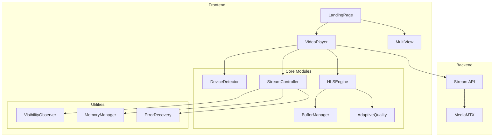
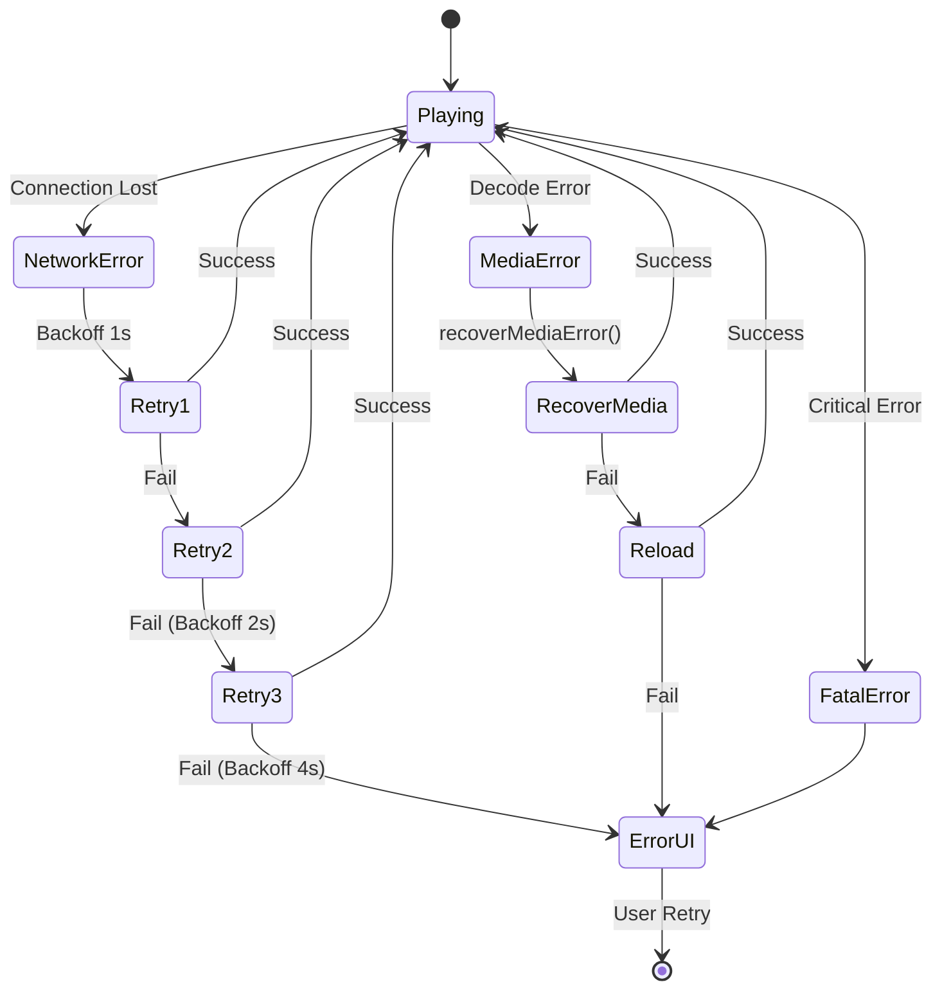

# Design Document: Media Player Optimization

## Overview

Dokumen ini menjelaskan desain teknis untuk optimasi Media Player pada sistem RAF NET CCTV Hub. Tujuan utama adalah membuat video player yang efisien, responsif, dan dapat berjalan dengan baik di semua jenis device dari low-end hingga high-end.

Pendekatan utama meliputi:
1. **Device-Adaptive Configuration** - Konfigurasi HLS yang menyesuaikan dengan kapabilitas device
2. **Intelligent Resource Management** - Manajemen memori dan buffer yang efisien
3. **Graceful Degradation** - Performa yang tetap baik meskipun resource terbatas
4. **Progressive Enhancement** - Fitur tambahan untuk device yang capable

## Architecture



## Components and Interfaces

### 1. DeviceDetector Module

Modul untuk mendeteksi kapabilitas device dan menentukan profil konfigurasi.

```typescript
interface DeviceCapabilities {
    tier: 'low' | 'medium' | 'high';
    ram: number;           // in GB
    cpuCores: number;
    isMobile: boolean;
    hasWebWorker: boolean;
    connectionType: 'slow-2g' | '2g' | '3g' | '4g' | 'wifi' | 'unknown';
    maxConcurrentStreams: number;
}

interface DeviceDetector {
    detect(): DeviceCapabilities;
    onCapabilityChange(callback: (caps: DeviceCapabilities) => void): void;
}
```

**Detection Logic:**
```javascript
const detectDeviceTier = () => {
    const ram = navigator.deviceMemory || 4; // Default 4GB if not available
    const cores = navigator.hardwareConcurrency || 4;
    const isMobile = /Android|iPhone|iPad|iPod/i.test(navigator.userAgent);
    
    // Low-end: RAM ≤ 2GB OR cores ≤ 2 OR mobile with RAM ≤ 3GB
    if (ram <= 2 || cores <= 2 || (isMobile && ram <= 3)) {
        return 'low';
    }
    // High-end: RAM > 4GB AND cores > 4
    if (ram > 4 && cores > 4) {
        return 'high';
    }
    return 'medium';
};
```

### 2. HLSEngine Configuration

Konfigurasi HLS.js yang adaptive berdasarkan device tier.

```typescript
interface HLSConfig {
    enableWorker: boolean;
    lowLatencyMode: boolean;
    backBufferLength: number;
    maxBufferLength: number;
    maxMaxBufferLength: number;
    maxBufferSize: number;
    maxBufferHole: number;
    startLevel: number;
    abrEwmaDefaultEstimate: number;
    abrBandWidthFactor: number;
    abrBandWidthUpFactor: number;
    fragLoadingTimeOut: number;
    fragLoadingMaxRetry: number;
    fragLoadingRetryDelay: number;
}

const getHLSConfig = (tier: DeviceTier): HLSConfig => {
    const configs = {
        low: {
            enableWorker: false,
            lowLatencyMode: false,
            backBufferLength: 10,
            maxBufferLength: 15,
            maxMaxBufferLength: 30,
            maxBufferSize: 30 * 1000 * 1000, // 30MB
            maxBufferHole: 0.5,
            startLevel: 0, // Start with lowest quality
            abrEwmaDefaultEstimate: 300000, // 300kbps
            abrBandWidthFactor: 0.7,
            abrBandWidthUpFactor: 0.5,
            fragLoadingTimeOut: 30000,
            fragLoadingMaxRetry: 4,
            fragLoadingRetryDelay: 2000,
        },
        medium: {
            enableWorker: true,
            lowLatencyMode: false,
            backBufferLength: 20,
            maxBufferLength: 25,
            maxMaxBufferLength: 45,
            maxBufferSize: 45 * 1000 * 1000, // 45MB
            maxBufferHole: 0.5,
            startLevel: -1, // Auto
            abrEwmaDefaultEstimate: 500000, // 500kbps
            abrBandWidthFactor: 0.8,
            abrBandWidthUpFactor: 0.6,
            fragLoadingTimeOut: 25000,
            fragLoadingMaxRetry: 5,
            fragLoadingRetryDelay: 1500,
        },
        high: {
            enableWorker: true,
            lowLatencyMode: false,
            backBufferLength: 30,
            maxBufferLength: 30,
            maxMaxBufferLength: 60,
            maxBufferSize: 60 * 1000 * 1000, // 60MB
            maxBufferHole: 0.5,
            startLevel: -1, // Auto
            abrEwmaDefaultEstimate: 1000000, // 1Mbps
            abrBandWidthFactor: 0.9,
            abrBandWidthUpFactor: 0.7,
            fragLoadingTimeOut: 20000,
            fragLoadingMaxRetry: 6,
            fragLoadingRetryDelay: 1000,
        }
    };
    return configs[tier];
};
```

### 3. StreamController

Mengontrol lifecycle stream video dengan visibility awareness.

```typescript
interface StreamController {
    initialize(videoElement: HTMLVideoElement, streamUrl: string): void;
    pause(): void;
    resume(): void;
    destroy(): void;
    onVisibilityChange(isVisible: boolean): void;
    onError(error: HLSError): void;
}

interface StreamState {
    status: 'idle' | 'loading' | 'playing' | 'paused' | 'error';
    isVisible: boolean;
    pausedAt: number | null;
    retryCount: number;
    hlsInstance: Hls | null;
}
```

### 4. ErrorRecovery Module

Menangani error dengan exponential backoff dan graceful recovery.

```typescript
interface ErrorRecovery {
    handleNetworkError(hls: Hls, retryCount: number): Promise<boolean>;
    handleMediaError(hls: Hls): Promise<boolean>;
    handleFatalError(hls: Hls): void;
    getBackoffDelay(retryCount: number): number;
}

const getBackoffDelay = (retryCount: number): number => {
    // Exponential backoff: 1s, 2s, 4s, 8s (max)
    return Math.min(1000 * Math.pow(2, retryCount), 8000);
};
```

### 5. VisibilityObserver

Menggunakan Intersection Observer untuk mendeteksi visibility.

```typescript
interface VisibilityObserver {
    observe(element: HTMLElement, callback: (isVisible: boolean) => void): void;
    unobserve(element: HTMLElement): void;
    disconnect(): void;
}

const createVisibilityObserver = () => {
    const callbacks = new Map();
    
    const observer = new IntersectionObserver(
        (entries) => {
            entries.forEach(entry => {
                const callback = callbacks.get(entry.target);
                if (callback) {
                    callback(entry.isIntersecting);
                }
            });
        },
        { threshold: 0.1 } // 10% visible triggers callback
    );
    
    return {
        observe: (element, callback) => {
            callbacks.set(element, callback);
            observer.observe(element);
        },
        unobserve: (element) => {
            callbacks.delete(element);
            observer.unobserve(element);
        },
        disconnect: () => {
            callbacks.clear();
            observer.disconnect();
        }
    };
};
```

### 6. MultiViewManager

Mengelola multiple streams dengan resource limits.

```typescript
interface MultiViewManager {
    addStream(camera: Camera): boolean;
    removeStream(cameraId: number): void;
    getActiveStreams(): Camera[];
    getMaxStreams(): number;
    staggerInitialization(cameras: Camera[]): Promise<void>;
}

const staggerInitialization = async (cameras: Camera[], delayMs: number = 100) => {
    for (let i = 0; i < cameras.length; i++) {
        if (i > 0) {
            await new Promise(resolve => setTimeout(resolve, delayMs));
        }
        initializeStream(cameras[i]);
    }
};
```

## Data Models

### Device Profile

```typescript
interface DeviceProfile {
    tier: 'low' | 'medium' | 'high';
    capabilities: DeviceCapabilities;
    hlsConfig: HLSConfig;
    maxConcurrentStreams: number;
    features: {
        enableZoom: boolean;
        enableMultiView: boolean;
        enableSnapshot: boolean;
        enableWorker: boolean;
    };
}
```

### Stream Instance

```typescript
interface StreamInstance {
    id: string;
    cameraId: number;
    hlsInstance: Hls | null;
    videoElement: HTMLVideoElement | null;
    state: StreamState;
    createdAt: number;
    lastActivityAt: number;
}
```

## Correctness Properties

*A property is a characteristic or behavior that should hold true across all valid executions of a system-essentially, a formal statement about what the system should do. Properties serve as the bridge between human-readable specifications and machine-verifiable correctness guarantees.*

### Property 1: Device Capability Detection Consistency

*For any* device environment, the DeviceDetector SHALL return a consistent DeviceCapabilities object with valid tier classification ('low', 'medium', or 'high') based on the detected hardware metrics.

**Validates: Requirements 1.1**

### Property 2: Device-based HLS Configuration

*For any* device tier classification, the HLS configuration returned by getHLSConfig SHALL have:
- enableWorker = false for 'low' tier
- enableWorker = true for 'medium' and 'high' tiers
- maxBufferLength ≤ 15 for 'low' tier
- maxBufferLength ≤ 30 for 'high' tier

**Validates: Requirements 1.2, 1.3, 1.4, 1.5**

### Property 3: Buffer Size Invariant

*For any* buffer state, the total buffer size SHALL never exceed the configured maxBufferSize for the current device tier.

**Validates: Requirements 2.1**

### Property 4: Buffer Trimming on Threshold

*For any* buffer state where size exceeds threshold, the BufferManager SHALL trim old segments such that the resulting buffer size is within acceptable limits.

**Validates: Requirements 2.2**

### Property 5: Resource Cleanup Completeness

*For any* stream lifecycle event (camera switch or component unmount), all associated resources (HLS instance, video element src, event listeners) SHALL be properly released.

**Validates: Requirements 2.4, 2.5**

### Property 6: Exponential Backoff Recovery

*For any* network error recovery attempt, the delay between retries SHALL follow exponential backoff pattern: delay(n) = min(1000 * 2^n, 8000) milliseconds.

**Validates: Requirements 3.1**

### Property 7: Live Edge Resume

*For any* successful error recovery, the stream SHALL resume playback from the live edge (most recent segment) rather than from the error point.

**Validates: Requirements 3.4**

### Property 8: Brief Buffer No Spinner

*For any* buffering event lasting less than 2 seconds, the Video_Player SHALL NOT display a loading spinner.

**Validates: Requirements 3.5**

### Property 9: Visibility-based Stream Control

*For any* visibility state change:
- When isVisible changes from true to false, stream SHALL be paused after 5 seconds
- When isVisible changes from false to true, stream SHALL resume playback

**Validates: Requirements 4.2, 4.3**

### Property 10: Multi-View Stream Limits

*For any* Multi-View activation on a device with tier T, the number of concurrent streams SHALL NOT exceed:
- 2 streams for 'low' tier
- 3 streams for 'medium' and 'high' tiers

**Validates: Requirements 4.5**

### Property 11: Zoom/Pan Event Throttling

*For any* sequence of zoom/pan events, the actual transform updates SHALL be throttled to maximum 60 updates per second (16.67ms minimum interval).

**Validates: Requirements 5.2**

### Property 12: Bandwidth-based Quality Adaptation

*For any* bandwidth measurement:
- When bandwidth < 500kbps, quality level SHALL be reduced
- When bandwidth > 2Mbps (stable), higher quality levels SHALL be allowed

**Validates: Requirements 6.2, 6.3**

### Property 13: Network Change Re-evaluation

*For any* network type change event, the AdaptiveQuality system SHALL re-evaluate and potentially adjust HLS configuration within 1 second.

**Validates: Requirements 6.5**

### Property 14: Mobile HLS Configuration

*For any* mobile device detection, the HLS configuration SHALL use mobile-optimized settings including smaller initial buffer and conservative ABR.

**Validates: Requirements 7.1, 7.2**

### Property 15: Orientation Change Stability

*For any* device orientation change, the Video_Player SHALL adapt layout without triggering stream reload or HLS re-initialization.

**Validates: Requirements 7.4**

### Property 16: Staggered Stream Initialization

*For any* Multi-View activation with N cameras, stream initialization SHALL be staggered with minimum 100ms delay between each stream start.

**Validates: Requirements 8.1**

### Property 17: Multi-View Error Isolation

*For any* error occurring in one stream within Multi-View, other streams SHALL continue playing unaffected.

**Validates: Requirements 8.3**

### Property 18: Multi-View Cleanup

*For any* Multi-View exit event, ALL stream instances SHALL be properly destroyed and resources released.

**Validates: Requirements 8.5**

## Error Handling

### Error Categories

1. **Network Errors** (recoverable)
   - Connection timeout
   - DNS resolution failure
   - Server unreachable
   - Recovery: Exponential backoff retry

2. **Media Errors** (partially recoverable)
   - Codec not supported
   - Corrupted segment
   - Recovery: recoverMediaError() then reload

3. **Fatal Errors** (non-recoverable)
   - HLS not supported
   - Invalid manifest
   - Recovery: Display error UI with manual retry

### Error Recovery Flow



## Testing Strategy

### Unit Tests

Unit tests akan fokus pada:
- DeviceDetector tier classification logic
- HLS configuration generation per tier
- Backoff delay calculation
- Buffer threshold calculations

### Property-Based Tests

Property-based tests menggunakan **fast-check** library untuk JavaScript:

1. **Device Configuration Property Test**
   - Generate random device capabilities
   - Verify HLS config matches expected tier settings

2. **Buffer Management Property Test**
   - Generate random buffer states
   - Verify buffer never exceeds limits

3. **Backoff Delay Property Test**
   - Generate random retry counts
   - Verify delay follows exponential pattern

4. **Stream Limit Property Test**
   - Generate random device tiers and stream counts
   - Verify limits are enforced

### Integration Tests

- Full stream lifecycle (init → play → pause → destroy)
- Multi-View stream management
- Error recovery scenarios
- Visibility-based stream control

### Test Configuration

```javascript
// Property test configuration
const propertyTestConfig = {
    numRuns: 100,  // Minimum 100 iterations per property
    seed: Date.now(),
    verbose: true
};
```

