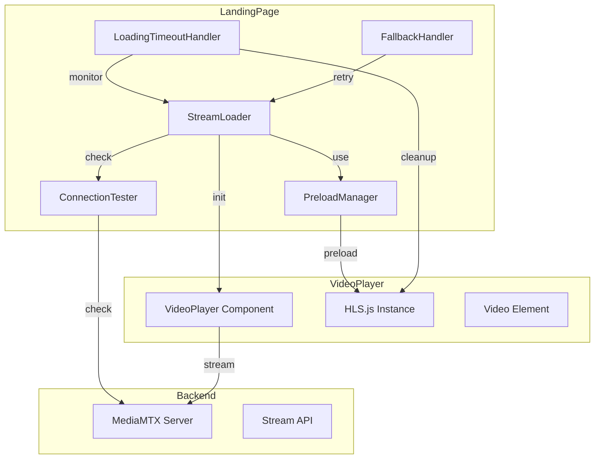
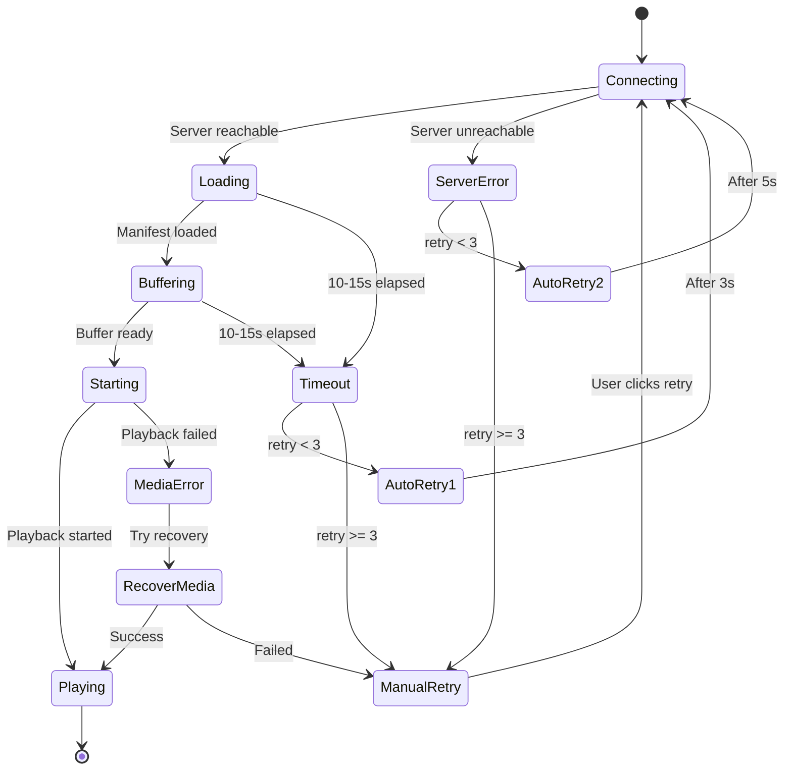

# Design Document: Stream Loading Fix

## Overview

Dokumen ini menjelaskan desain teknis untuk memperbaiki masalah loading stream CCTV yang stuck/tidak responsif, khususnya pada device low-end. Masalah utama adalah stream stuck loading di LandingPage pada Chrome di laptop low-end, padahal di admin sudah ada traffic.

Pendekatan utama:
1. **Loading Timeout Detection** - Mendeteksi stuck loading dengan timeout yang device-adaptive
2. **HLS.js Preloading** - Preload HLS.js saat halaman mount untuk mempercepat initial load
3. **Connection Pre-check** - Verifikasi konektivitas sebelum memulai stream
4. **Progressive Loading Feedback** - Tampilkan progress loading yang jelas
5. **Automatic Recovery** - Auto-retry dengan limit sebelum manual intervention

## Architecture



## Components and Interfaces

### 1. PreloadManager Module

Modul untuk preloading HLS.js module di background saat halaman mount.

```typescript
interface PreloadManager {
    preloadHls(): Promise<typeof Hls>;
    isPreloaded(): boolean;
    getPreloadedHls(): typeof Hls | null;
    getPreloadStatus(): 'idle' | 'loading' | 'loaded' | 'error';
}

// Singleton instance untuk caching
let hlsModule: typeof Hls | null = null;
let preloadPromise: Promise<typeof Hls> | null = null;
let preloadStatus: 'idle' | 'loading' | 'loaded' | 'error' = 'idle';

const preloadHls = async (): Promise<typeof Hls> => {
    if (hlsModule) return hlsModule;
    if (preloadPromise) return preloadPromise;
    
    preloadStatus = 'loading';
    preloadPromise = import('hls.js').then(module => {
        hlsModule = module.default;
        preloadStatus = 'loaded';
        return hlsModule;
    }).catch(error => {
        preloadStatus = 'error';
        throw error;
    });
    
    return preloadPromise;
};
```

### 2. ConnectionTester Module

Modul untuk menguji konektivitas ke MediaMTX sebelum memulai stream.

```typescript
interface ConnectionTestResult {
    reachable: boolean;
    latency: number;
    error?: string;
}

interface ConnectionTester {
    testConnection(url: string, timeout?: number): Promise<ConnectionTestResult>;
    isServerReachable(url: string): Promise<boolean>;
}

const testConnection = async (url: string, timeout = 5000): Promise<ConnectionTestResult> => {
    const controller = new AbortController();
    const timeoutId = setTimeout(() => controller.abort(), timeout);
    const startTime = performance.now();
    
    try {
        // Use HEAD request for lightweight check
        const response = await fetch(url, {
            method: 'HEAD',
            signal: controller.signal,
            mode: 'no-cors', // Allow cross-origin
        });
        
        clearTimeout(timeoutId);
        const latency = performance.now() - startTime;
        
        return {
            reachable: true,
            latency,
        };
    } catch (error) {
        clearTimeout(timeoutId);
        return {
            reachable: false,
            latency: -1,
            error: error.name === 'AbortError' ? 'Connection timeout' : error.message,
        };
    }
};
```

### 3. LoadingTimeoutHandler Module

Modul untuk mendeteksi dan menangani stuck loading.

```typescript
interface LoadingTimeoutConfig {
    lowEndTimeout: number;  // 15000ms
    highEndTimeout: number; // 10000ms
    maxConsecutiveFailures: number; // 3
}

interface LoadingTimeoutHandler {
    startTimeout(deviceTier: DeviceTier): void;
    clearTimeout(): void;
    onTimeout(callback: (stage: LoadingStage) => void): void;
    getConsecutiveFailures(): number;
    resetFailures(): void;
}

const getTimeoutDuration = (deviceTier: DeviceTier): number => {
    return deviceTier === 'low' ? 15000 : 10000;
};
```

### 4. StreamLoader Module

Modul utama yang mengkoordinasikan loading stream dengan timeout dan recovery.

```typescript
type LoadingStage = 'connecting' | 'loading' | 'buffering' | 'starting' | 'playing' | 'error' | 'timeout';

interface StreamLoaderState {
    stage: LoadingStage;
    progress: number;
    error: StreamError | null;
    retryCount: number;
    autoRetryCount: number;
    deviceTier: DeviceTier;
}

interface StreamLoader {
    load(streamUrl: string): Promise<void>;
    retry(): void;
    destroy(): void;
    getState(): StreamLoaderState;
    onStageChange(callback: (stage: LoadingStage) => void): void;
}

const LOADING_STAGES: Record<LoadingStage, string> = {
    connecting: 'Connecting to server...',
    loading: 'Loading stream data...',
    buffering: 'Buffering video...',
    starting: 'Starting playback...',
    playing: 'Live',
    error: 'Connection failed',
    timeout: 'Loading timeout',
};
```

### 5. FallbackHandler Module

Modul untuk menangani error dan auto-retry.

```typescript
interface FallbackConfig {
    autoRetryDelay: number;     // 3000ms
    maxAutoRetries: number;     // 3
    networkRetryDelay: number;  // 3000ms
    serverRetryDelay: number;   // 5000ms
}

interface FallbackHandler {
    handleError(error: StreamError): void;
    shouldAutoRetry(): boolean;
    getRetryDelay(errorType: ErrorType): number;
    onNetworkRestore(callback: () => void): void;
}

const getRetryDelay = (errorType: ErrorType): number => {
    switch (errorType) {
        case 'network':
            return 3000;
        case 'server':
            return 5000;
        case 'timeout':
            return 3000;
        default:
            return 3000;
    }
};
```

## Data Models

### StreamError

```typescript
interface StreamError {
    type: 'timeout' | 'network' | 'server' | 'media' | 'unknown';
    message: string;
    stage: LoadingStage;
    deviceTier: DeviceTier;
    timestamp: number;
    retryCount: number;
    details?: {
        url?: string;
        statusCode?: number;
        hlsError?: any;
    };
}
```

### DiagnosticInfo

```typescript
interface DiagnosticInfo {
    error: StreamError;
    deviceCapabilities: DeviceCapabilities;
    connectionTest: ConnectionTestResult;
    loadingDuration: number;
    userAgent: string;
    timestamp: string;
}
```

## Correctness Properties

*A property is a characteristic or behavior that should hold true across all valid executions of a system-essentially, a formal statement about what the system should do. Properties serve as the bridge between human-readable specifications and machine-verifiable correctness guarantees.*

### Property 1: Device-Adaptive Timeout Duration

*For any* device tier, the loading timeout duration SHALL be:
- 15000ms for 'low' tier devices
- 10000ms for 'medium' and 'high' tier devices

**Validates: Requirements 1.1, 5.3**

### Property 2: HLS Module Caching

*For any* sequence of calls to preloadHls(), the function SHALL return the same cached HLS.js module instance after the first successful load.

**Validates: Requirements 2.2, 2.3**

### Property 3: Connection Test Timeout

*For any* connection test, the test SHALL timeout after exactly 5000ms if no response is received.

**Validates: Requirements 3.4**

### Property 4: Server Unreachable Error

*For any* connection test that fails (timeout or error), the result SHALL have reachable=false and include an error message.

**Validates: Requirements 3.2**

### Property 5: Loading Stage Progression

*For any* successful stream load, the loading stages SHALL progress in order: 'connecting' → 'loading' → 'buffering' → 'starting' → 'playing'.

**Validates: Requirements 4.1, 4.2, 4.3, 4.4**

### Property 6: Auto-Retry Limit

*For any* stream loading failure, the FallbackHandler SHALL limit automatic retries to exactly 3 attempts before requiring manual intervention.

**Validates: Requirements 6.2, 6.4**

### Property 7: Auto-Retry Delay

*For any* network error, the auto-retry delay SHALL be exactly 3000ms.

**Validates: Requirements 6.1**

### Property 8: Resource Cleanup on Timeout

*For any* loading timeout event, the LoadingTimeoutHandler SHALL:
- Destroy HLS instance (hlsRef.current = null)
- Clear video element source (video.src = '')
- Cancel pending requests (abort controller)

**Validates: Requirements 1.3, 7.1, 7.2, 7.3**

### Property 9: Consecutive Failure Tracking

*For any* sequence of timeout failures, the LoadingTimeoutHandler SHALL track consecutive failures and suggest troubleshooting after exactly 3 consecutive failures.

**Validates: Requirements 1.4**

### Property 10: Error Diagnostic Information

*For any* stream error, the error object SHALL include:
- Error type (timeout, network, server, media)
- Loading stage where error occurred
- Device tier information

**Validates: Requirements 8.1, 8.2, 8.3**

### Property 11: Low-End Animation Disable

*For any* low-end device, loading animations SHALL be disabled (no animate-pulse, animate-spin classes during loading).

**Validates: Requirements 5.2**

### Property 12: Cleanup on Unmount

*For any* component unmount during loading, all resources SHALL be cleaned up immediately (HLS destroyed, timeouts cleared, listeners removed).

**Validates: Requirements 7.4, 7.5**

## Error Handling

### Error Categories

1. **Timeout Errors** (recoverable)
   - Loading took too long
   - Recovery: Auto-retry with fresh connection

2. **Network Errors** (recoverable)
   - Connection lost
   - DNS failure
   - Recovery: Auto-retry after 3s

3. **Server Errors** (partially recoverable)
   - MediaMTX unreachable
   - 5xx errors
   - Recovery: Auto-retry after 5s, max 3 times

4. **Media Errors** (partially recoverable)
   - Codec issues
   - Corrupted segments
   - Recovery: HLS recoverMediaError()

### Error Recovery Flow



## Testing Strategy

### Unit Tests

Unit tests akan fokus pada:
- Timeout duration calculation per device tier
- Connection test timeout behavior
- Auto-retry limit enforcement
- Loading stage progression
- Error type classification

### Property-Based Tests

Property-based tests menggunakan **fast-check** library:

1. **Timeout Duration Property Test**
   - Generate random device tiers
   - Verify timeout matches expected value

2. **HLS Caching Property Test**
   - Multiple calls to preloadHls
   - Verify same instance returned

3. **Auto-Retry Limit Property Test**
   - Generate random failure sequences
   - Verify max 3 auto-retries

4. **Resource Cleanup Property Test**
   - Simulate timeout events
   - Verify all resources cleaned up

### Integration Tests

- Full loading flow with timeout
- Auto-retry sequence
- Network restore reconnection
- Multi-stream concurrent loading on low-end

### Test Configuration

```javascript
// Property test configuration
const propertyTestConfig = {
    numRuns: 100,  // Minimum 100 iterations per property
    seed: Date.now(),
    verbose: true
};
```

