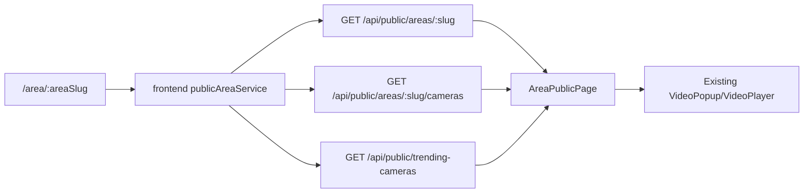

<!--
Purpose: Design the first growth-focused public feature batch for RAF NET CCTV.
Caller: Product planning before implementation plans and code changes.
Deps: SYSTEM_MAP.md, frontend/backend module maps, existing public landing/playback/viewer analytics flows.
MainFuncs: Defines area SEO pages, trending CCTV, and improved public sharing scope.
SideEffects: Documentation only.
-->

# Public Growth Foundation Design

## Goal

Increase public discovery and shareability without destabilizing live streaming, playback tokens, or admin monitoring. The first batch should make RAF NET CCTV easier to find, easier to share, and more convincing to prospective clients.

The recommended batch is:

1. Public area pages with SEO-ready URLs.
2. Trending/top-viewed CCTV surfaces.
3. Better branded share text and links.

This batch intentionally avoids heavy AI/video analysis, paid billing, and large multi-tenant rewrites. Those can follow after the public growth layer proves useful.

## Success Criteria

- Public users can open a stable area page such as `/area/kab-surabaya`.
- Area pages show only public cameras and never expose RTSP URLs.
- Each area page has meaningful title, description, Open Graph metadata, and share text.
- Landing/grid mode can show top-viewed CCTV based on existing view stats.
- Share actions produce branded, readable text suitable for WhatsApp and social sharing.
- Existing `/`, `/playback`, admin pages, live viewer tracking, and playback tracking keep working.

## Approach Options

### Option A: Public Growth Foundation First

Build area SEO pages, trending CCTV, and share improvements using existing public camera/view stats data.

Pros:
- Highest marketing value for the least risk.
- Uses data already collected by live viewer tracking.
- Improves both organic discovery and daily sharing.

Cons:
- Does not yet solve client-specific branding or reporting.

Recommendation: choose this for the first batch.

### Option B: Client/NOC Commercialization First

Start with per-client branding, reports, and Telegram routing polish.

Pros:
- Stronger direct sales value.
- Good for ISP/client demos.

Cons:
- Bigger schema/UI scope and slower public growth impact.

### Option C: Playback Premium Product First

Focus on token monetization, quota polish, and public playback upsell.

Pros:
- Clear premium feature path.
- Builds on recent token work.

Cons:
- Less useful for public discovery unless people already know the site.

## Chosen Design

Implement Option A as a focused foundation.

### Frontend

Add a public route:

- `/area/:areaSlug`

The route should render an operational public area page, not a marketing landing page. It should include:

- Area name and concise public description.
- Camera count, online count, and total/session view signals.
- Top/trending CCTV section for that area.
- Grid/map entry points using existing public camera cards and video popup behavior.
- Share button for the area.
- Empty state when an area has no public cameras.

The main `/` landing page should add a compact top-viewed section for "All Area" before or near the public camera grid. It should stay dense and useful, not become a decorative landing page.

### Backend

Add public read endpoints that return sanitized data only:

- `GET /api/public/areas/:slug`
- `GET /api/public/areas/:slug/cameras`
- `GET /api/public/trending-cameras?areaSlug=&limit=`

The endpoints should never return RTSP URLs, credentials, internal proxy secrets, or admin-only camera fields. They should reuse existing camera public read models where possible.

Trending should use existing `camera_view_stats` first. If a camera has no stats, sort it below viewed cameras using deterministic fallback such as name/id.

### SEO And Metadata

Frontend runtime metadata should update per area:

- Title: `CCTV Online <Area Name> - RAF NET`
- Description: `Pantau CCTV publik area <Area Name> secara online melalui RAF NET.`
- Open Graph URL and image should use the current route and area/camera thumbnail if available.

Because the app is Vite SPA, this first batch will improve in-browser/share metadata. Server-side prerendering can be planned later if Google indexing needs stronger crawl output.

### Sharing

Add shared helper utilities for branded text:

- Area share text.
- Camera share text.
- Playback token share text should remain separate from public live camera share text.

Default area share format:

```text
CCTV Online <Area Name> - RAF NET
Pantau kamera publik area <Area Name>:
<url>
```

Default camera share format:

```text
CCTV <Camera Name> - RAF NET
Area: <Area Name>
Live: <url>
```

### Data Flow



## Error Handling

- Unknown slug returns a friendly public 404 state.
- API timeout shows existing retry/error UI without session-expired auth noise.
- Empty camera list shows a public empty state.
- If trending stats fail, the area page still renders normal cameras.

## Performance

- Limit trending queries, default 10.
- Avoid N+1 camera stats queries by joining or batching.
- Reuse thumbnail URLs and existing public camera list data.
- Cache public area metadata if existing cache middleware pattern fits the route.

DB note: trending queries must use indexed camera stats/camera IDs and avoid scanning session history tables on each public request.

## Security

- Public endpoints must use sanitized response fields.
- Do not expose RTSP URLs, username/password, internal ingest mode notes, Telegram config, recording paths, or admin status fields.
- Public area pages only show cameras marked public/online according to existing public visibility rules.

## Testing

Backend:

- Public area lookup by slug.
- Unknown slug response.
- Public camera sanitization excludes RTSP/credentials.
- Trending query orders by existing stats and respects area filter/limit.

Frontend:

- `/area/:areaSlug` renders area title and cameras.
- Unknown area displays public not-found state.
- Top-viewed section appears on landing/all area.
- Share text includes brand, area/camera name, and URL.

Manual:

- Open `/`, `/area/kab-surabaya`, `/playback`, and an admin route.
- Confirm no session-expired popup on public pages.
- Confirm video popup still opens from area page.

## Out Of Scope For This Batch

- Paid plans or billing.
- Server-side rendering/prerendering.
- Per-client custom domains.
- AI analytics.
- PDF uptime reporting.
- New Telegram routing rules.

## Follow-Up Batches

1. Client branding per area/client.
2. Uptime/SLA report dashboard and scheduled share/export.
3. Playback token packaging and public upsell flow.
4. Embed widget for client websites.
5. Strong SEO prerender/sitemap if public indexing becomes the main growth channel.
